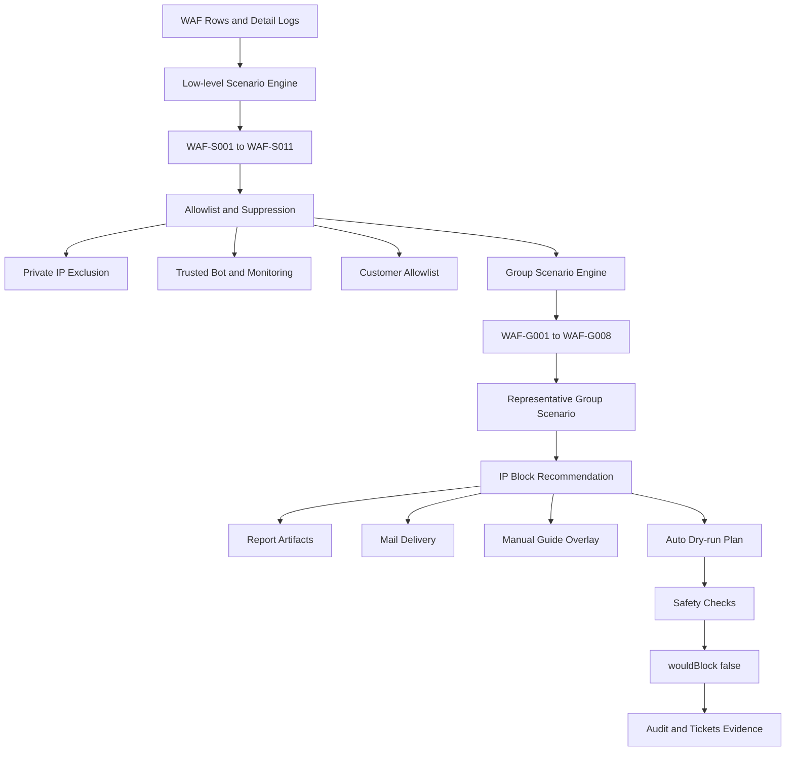

# WAF Group Scenario 운영 정책

## 1. 목적

`WAF-S001`~`WAF-S011`은 low-level detection rule로 유지한다. 각 rule은 VT/TI, 반복 스캐닝, Critical 단건, 고객사 커스텀 필터, 공격 시퀀스, 복수 공격 유형, 분산 유사 공격, AI 분석 신호를 각각 계산하는 근거 계층이다.

`WAF-G001`~`WAF-G008`은 보안 담당자에게 표시할 operator-facing response scenario로 사용한다. 운영 보고서, Gmail preview, manual overlay는 장기적으로 `WAF-Gxxx` 중심으로 표시하고, `WAF-Sxxx`는 상세 근거로 유지한다.

이 문서는 현재 구현된 group scenario 구조의 운영 정책을 정의한다. 이번 단계에서는 코드, threshold, priorityScore, Gmail 발송 로직, overlay 로직, auto mode 동작을 변경하지 않는다.

## 2. 전체 구조

WAF 자동화는 다음 순서로 판단한다.



`WAF-Sxxx`에서 먼저 low-level evidence를 계산하고, allowlist와 suppression을 적용한 뒤 `WAF-Gxxx`를 operator-facing 판단 계층으로 승격한다. 이후 representative group, report, guide, auto dry-run, tickets publish가 모두 같은 운영형 판단을 공유한다.

```text
WAF rows/detail
-> low-level scenario engine (WAF-S001~S011)
-> group scenario engine (WAF-G001~G008)
-> representativeGroupScenario
-> ipBlockRecommendation
-> manualBlockGuidance
-> report/Gmail/overlay
```

운영 화면과 보고서의 첫 문장은 `representativeGroupScenario`를 우선 사용한다. Low-level `representativeScenario`와 `matchedScenarios`는 상세 근거, evidence table, no-match reason에 남겨 원인 추적이 가능해야 한다.

## 3. WAF-G001~G008 정책 표

| Group Code | 이름 | 매핑 low-level | 운영 목적 | Gmail 발송 적합성 | Manual overlay 적합성 | Report-only 여부 | Auto 후보 여부 | 필요한 안전장치 | 현재 권장 상태 |
|---|---|---|---|---|---|---|---|---|---|
| WAF-G001 | 반복 스캐닝 기반 IP 차단 검토 | S002, S003, S004, S005 | 동일 IP의 Low/Middle/High/Critical 반복 스캐닝을 묶어 본다. | High/Critical 중심 조건부 | High/Critical 반복 시 가능 | Low/Middle은 기본 report-only | 보류 | allowlist, 검색엔진/모니터링 제외, severity별 threshold | 조건부 유지 |
| WAF-G002 | 고위험 단건 공격 검토 | S006 | 비스캐닝 Critical 단건 공격을 빠르게 수동 확인한다. | 가능 | 가능 | 아님 | 장기 검토 | allowlist, 공격 유형 검증, 고객사 예외 정책 | 유지 |
| WAF-G003 | 고객사 중요 필터 검토 | S007 | 고객사별 중요 커스텀 필터 매칭을 운영 정책으로 반영한다. | 조건부 | 가능 | 단건은 report-only 검토 | 보류 | 고객사 rule owner, matchedEvents, blocked 조건 | 조건부 유지 |
| WAF-G004 | 공격 시퀀스 기반 검토 | S009 | probe -> admin-access -> exploit-payload 흐름을 포착한다. | 가능 | 가능 | 아님 | 보류 | phase evidence, timeWindow, same-IP 검증 | 유지 |
| WAF-G005 | 복합 공격 유형 검토 | S010 | 동일 IP의 복수 공격 유형 또는 위험도 혼합을 확인한다. | 가능 | 가능 | 단일 row 매칭은 튜닝 후보 | 보류 | 최소 이벤트 수, uniquePaths, parser 품질, suppression | 대표 시나리오로 유지 |
| WAF-G006 | 분산 유사 공격 검토 | S011 | 다수 IP의 유사 공격을 봇넷/프록시/분산 스캔 관점에서 본다. | 가능 | 가능 | 아님 | 매우 장기 검토 | distinct IP 기준, 유사도, CDN/NAT 제외 | 유지 |
| WAF-G007 | 외부 평판/TI 보강 검토 | S001 | VT/TI 평판으로 기존 WAF 판단의 신뢰도를 보강한다. | 신뢰도 검증 후 가능 | 보조 가능 | 단독은 report-only 권장 | 없음 | API key, rate limit, cache, private IP 제외 | 보조 근거 |
| WAF-G008 | AI 분석 보강 검토 | S008 | AI/rule-based 악성 확률로 우선순위를 보강한다. | 단독은 비권장 | 보조 가능 | 단독은 report-only 권장 | 없음 | explainability, provider audit, concrete evidence 결합 | 보조 근거 |

## 4. Group Scenario별 운영 정책

## WAF-G001 반복 스캐닝 기반 IP 차단 검토

- 목적: 동일 IP에서 반복되는 Low/Middle/High/Critical 스캐닝을 묶어 운영자가 볼 수 있게 한다.
- 매핑 scenario: `WAF-S002`, `WAF-S003`, `WAF-S004`, `WAF-S005`
- Gmail 발송 정책: Low/Middle 단독은 발송보다 report-only를 우선한다. High/Critical 반복 또는 차단 이벤트가 결합된 경우 Gmail 후보로 검토한다.
- Overlay 정책: High/Critical 반복 또는 명확한 차단 포함 시 manual overlay 후보가 될 수 있다.
- Report-only 조건: Low/Middle 반복, 검색엔진/모니터링 가능성이 있는 이벤트, allowlist/suppression 미확인 상태.
- Auto 후보 여부: 보류.
- 안전장치: allowlist, 검색엔진/모니터링 IP 제외, 고객사 허용 IP 보호, severity별 threshold 검토.
- 조정 후보: Low/Middle threshold 상향, High/Critical만 operator-facing alert로 승격.
- 현재 권장안: report-first로 유지하고 High/Critical 반복만 수동 확인 후보로 올린다.

## WAF-G002 고위험 단건 공격 검토

- 목적: 스캐닝성이 아닌 Critical 단건 공격을 빠르게 확인한다.
- 매핑 scenario: `WAF-S006`
- Gmail 발송 정책: RCE, WebShell, LFI, SQLi 등 명확한 고위험 공격이면 Gmail 가능.
- Overlay 정책: 수동차단 안내 후보로 적합하다.
- Report-only 조건: classification 불명확, parser confidence 낮음, allowlist 미확인.
- Auto 후보 여부: 장기 검토.
- 안전장치: allowlist 필수, 공격 유형 evidence 확인, 고객사 예외 정책.
- 조정 후보: Critical 유형별 Gmail/overlay 우선순위 세분화.
- 현재 권장안: allowlist/suppression 통과 후 manual guidance 후보로 유지한다.

## WAF-G003 고객사 중요 필터 검토

- 목적: 고객사 또는 그룹별 중요 커스텀 필터를 운영 정책에 반영한다.
- 매핑 scenario: `WAF-S007`
- Gmail 발송 정책: 조건부. 고객사 정책상 중요 필터이거나 차단 이벤트가 포함되면 발송 후보가 된다.
- Overlay 정책: 고객사 정책에 따라 manual overlay 가능.
- Report-only 조건: 단건 매칭, 탐지만 있고 차단 없음, 운영 피로도 가능성이 높은 필터.
- Auto 후보 여부: 보류.
- 안전장치: customer/group 매칭, rule owner, 필터 만료/검토 주기, allowlist.
- 조정 후보: `matchedEvents` 또는 `blocked` 조건 추가 검토.
- 현재 권장안: 지원 근거로 유지하되 단건 커스텀 필터는 운영 피로도를 관찰한다.

## WAF-G004 공격 시퀀스 기반 검토

- 목적: 단일 로그 위험도보다 공격자의 시간순 행위를 본다.
- 매핑 scenario: `WAF-S009`
- Gmail 발송 정책: probe -> admin-access -> exploit-payload 흐름이 확인되면 발송 대상.
- Overlay 정책: manual overlay 대상으로 적합하다.
- Report-only 조건: phase가 2개 이하, 순서 불일치, timeWindow 초과.
- Auto 후보 여부: 보류.
- 안전장치: same-IP 검증, phase evidence, timestamp 정렬, timeWindow 검증.
- 조정 후보: phase 키워드와 no-match reason 품질 강화.
- 현재 권장안: PLURA-XDR AI Agent의 차별점으로 유지하고 evidence를 계속 강화한다.

## WAF-G005 복합 공격 유형 검토

- 목적: 동일 IP에서 `SCANNER`, `SECURITY MISCONFIGURATION`, `LFI`, `WEBSHELL` 등 복수 공격 유형 또는 위험도가 함께 나타나는지 확인한다.
- 매핑 scenario: `WAF-S010`
- Gmail 발송 정책: Gmail 대상에 적합하다. 다만 단일 row 내 복수 classification만으로 매칭된 경우 표현과 발송 우선순위를 조심한다.
- Overlay 정책: manual overlay 대상으로 적합하다.
- Report-only 조건: `totalEvents=1`이고 단일 row classification 혼합만 있는 경우.
- Auto 후보 여부: 보류.
- 안전장치: minimum events, uniquePaths, parser 품질, allowlist/suppression.
- 조정 후보: `totalEvents >= 2`, `uniquePaths >= 2`, 또는 `distinctAttackTypes >= 2 AND totalEvents >= 2`.
- 현재 권장안: 현재 live 대표 운영형 시나리오로 적절하다. 단, 단일 row match의 반복/흐름 표현은 피한다.

## WAF-G006 분산 유사 공격 검토

- 목적: 짧은 시간 안에 유사 공격이 다수 IP에서 발생하는 봇넷, 프록시, 분산 스캔을 탐지한다.
- 매핑 scenario: `WAF-S011`
- Gmail 발송 정책: distinct IP 기준과 유사도 기준이 충족되면 발송 대상.
- Overlay 정책: 다수 IP 차단 검토 안내로 확장 가능하나, 현재는 수동 확인 안내까지만 적합하다.
- Report-only 조건: distinct IP 부족, timeWindow 초과, similarAttackKey 불명확.
- Auto 후보 여부: 매우 보수적인 장기 검토.
- 안전장치: CDN/NAT 제외, 고객사 allowlist, path/query 유사도, 차단 대상 범위 제한.
- 조정 후보: similarAttackKey와 timeWindow 튜닝.
- 현재 권장안: 분산 공격 전용 group으로 유지한다.

## WAF-G007 외부 평판/TI 보강 검토

- 목적: VT/TI 평판으로 WAF 탐지의 신뢰도를 보강한다.
- 매핑 scenario: `WAF-S001`
- Gmail 발송 정책: VT/TI 신뢰도, freshness, malicious rate가 검증된 경우 가능.
- Overlay 정책: 단독 overlay보다 다른 group scenario와 결합 시 보조 근거로 사용한다.
- Report-only 조건: VT 결과 없음, totalEngines 부족, stale result, private/internal IP.
- Auto 후보 여부: 없음.
- 안전장치: API key 관리, rate limit, cache, lastAnalysisDate, private IP 제외, 고객사 allowlist.
- 조정 후보: VT/TI freshness와 cache 정책.
- 현재 권장안: 단독 차단 근거가 아니라 confidence 보강 용도로 사용한다.

## WAF-G008 AI 분석 보강 검토

- 목적: AI 또는 rule-based 악성 확률로 우선순위를 보강한다.
- 매핑 scenario: `WAF-S008`
- Gmail 발송 정책: 단독 AI 판단은 비권장. 다른 WAF group scenario와 결합될 때 우선순위 상승 근거로 사용한다.
- Overlay 정책: 보조 가능하나 단독 overlay는 신중히 적용한다.
- Report-only 조건: AI 분석 결과 없음, maliciousProbability 단독 충족, reasons/evidence 부족.
- Auto 후보 여부: 없음.
- 안전장치: explainability, provider audit, prompt/version 기록, concrete evidence 결합.
- 조정 후보: `maliciousProbability >= 0.7`은 유지하되 결합 정책을 명확화.
- 현재 권장안: 단독 차단 근거보다 보조 판단/priority 상승 용도로 사용한다.

## 5. Live manual:all 결과 해석

현재 기준 live manual batch 결과는 다음과 같이 해석한다.

| item | value |
|---|---|
| 실행 명령 | `npm.cmd run plura:waf:manual:all` |
| attackerIp | `20.220.233.65` |
| totalEvents | `13` |
| blockedEvents | `2` |
| detectedEvents | `11` |
| uniquePaths | `13` |
| matchedScenarios | `[7, 10]` |
| matchedGroupScenarios | `["WAF-G003", "WAF-G005"]` |
| representativeScenario | `WAF-S010` |
| representativeGroupScenario | `WAF-G005` |

해석:

- `WAF-G005`가 대표 운영형 시나리오로 적절하다.
- `WAF-G003`은 고객사 중요 필터 기반 supporting evidence로 유지한다.
- `WAF-G001`은 near-threshold 반복 스캐닝 근거로만 표시 가능하다.
- `WAF-S003` Middle은 `12/20`으로 미매칭이다.
- `WAF-S004` High는 `3/10`으로 미매칭이다.
- `WAF-S005` Critical은 `2/3`으로 미매칭이지만 threshold에 근접했다.
- `WAF-G004`는 admin-access phase 부족으로 미매칭이다.
- `WAF-G006`은 distinctIpCount 부족으로 미매칭이다.
- `WAF-G007`은 VT 결과 없음으로 미매칭이다.
- `WAF-G008`은 AI 분석 결과 없음으로 미매칭이다.

## 6. Gmail / Overlay / Report 정책 초안

| 구분 | Group Scenario | 권장 정책 |
|---|---|---|
| Gmail 발송 가능 | WAF-G004, WAF-G005, WAF-G006 | 공격 흐름, 복합 공격 유형, 분산 유사 공격은 관제 우선순위가 높다. |
| Gmail 발송 가능 | WAF-G007 | VT/TI 신뢰도, freshness, API/cache 품질 검증 후 가능하다. |
| 조건부 Gmail | WAF-G002 | Non-scanning Critical의 공격 유형과 allowlist 통과 여부를 확인한다. |
| 조건부 Gmail | WAF-G003 | 고객사 정책, matchedEvents, blocked 조건을 함께 본다. |
| 기본 report-only | WAF-G001 Low/Middle | noise 가능성이 높아 발송보다 보고서 기록을 우선한다. |
| 기본 report-only | WAF-G008 단독 AI 판단 | AI 결과만으로 차단 또는 high-priority alert를 만들지 않는다. |
| Manual overlay 가능 | WAF-G002, WAF-G003, WAF-G004, WAF-G005, WAF-G006 | 담당자 수동 확인과 수동차단 검토 안내에 적합하다. |
| Auto 후보 | 전체 | 현재는 모두 `false`. 운영 승인, allowlist, TTL, rollback, 감사 로그, 예외 IP 정책 이후 재검토한다. |

Report는 항상 `WAF-Gxxx`를 상단 대표로 표시하고, `WAF-Sxxx`는 상세 evidence와 no-match reason에 유지한다.

## 7. WAF-G005 튜닝 후보

현재 `WAF-S010`은 단일 row 안의 복수 classification만으로도 `matched=true`가 될 수 있다. 이 경우 "복합 공격 유형" 표현은 가능하지만 "반복/흐름" 의미는 약하다.

향후 튜닝 후보:

- `totalEvents >= 2`
- `uniquePaths >= 2`
- `distinctAttackTypes >= 2 AND totalEvents >= 2`

아직 threshold나 logic은 변경하지 않는다. live 데이터가 더 쌓인 뒤 `WAF-G005`가 단일 row classification 혼합을 어떻게 표현하고 발송 우선순위를 줄지 결정한다.

## 8. Auto mode 활성화 전 필수 안전장치

Auto mode는 현재 계속 disabled로 유지한다. 활성화 전 최소한 다음 안전장치가 필요하다.

- allowlist/suppression
- 내부 IP / 고객사 허용 IP 보호
- 검색엔진/모니터링 IP 제외
- TTL 기반 자동 해제
- 차단 전 dry-run
- 승인 정책
- 감사 로그
- rollback 절차
- 고객사별 정책 분리
- 오탐 신고/해제 절차

## 9. 다음 구현 우선순위

1. Group scenario 정책 문서 리뷰
2. `WAF-G005` 조건 조정 여부 결정
3. `WAF-G003` 단건 커스텀 필터 정책 결정
4. Gmail subject/body를 `WAF-Gxxx` 중심으로 최종 정리
5. Manual overlay 문구를 `WAF-Gxxx` 중심으로 최종 정리
6. `WAF-G001` report-only 정책 반영
7. `WAF-G007`/`WAF-G008` 실제 연동은 마지막 단계
8. Auto mode는 계속 disabled 유지

## 10. WAF-G005 최종 운영 조건

WAF-G005 복합 공격 유형 검토는 운영 안정성 기준으로 다음 조건을 모두 만족할 때만 operator-facing group scenario로 승격한다.

- `distinctAttackTypes >= 2`
- `totalEvents >= 2`

Low-level `WAF-S010`은 기존처럼 단일 row 안의 복수 classification만으로도 상세 근거로 남길 수 있다. 다만 단일 row만으로는 반복성이나 흐름 근거가 약하므로 `WAF-G005` 대표 운영형 시나리오로 승격하지 않는다.

이 정책은 수동차단 안내, Gmail 제목, report 상단 요약에서 “IP주소 차단 검토 필요”가 과도하게 표시되는 것을 줄이기 위한 운영 안정성 조치다. `WAF-S010`이 matched=true이더라도 `totalEvents < 2`이면 `WAF-G005`는 matched=false로 기록하고, report에는 low-level 근거와 no-match reason을 함께 남긴다.

## 11. G005 Final Guardrail

- `WAF-S010` is kept as low-level evidence.
- `WAF-G005` is promoted only when `distinctAttackTypes >= 2` and `totalEvents >= 2`.
- A single row with multiple classifications remains valid `WAF-S010` evidence, but it must not become the representative operator-facing `WAF-G005` scenario by itself.
- This guardrail reduces Gmail, overlay, and manual guidance fatigue and improves the quality of future auto dry-run candidates.
## 12. G003 Final Guardrail

- WAF-S007 is kept as low-level evidence when a customer custom filter matches, even for a single event.
- WAF-G003 is promoted only when `matchedEvents >= 2` or `blockedEvents >= 1` or `forceGuide=true` or `severity=critical`.
- A single detected event by itself must not become the representative operator-facing WAF-G003 scenario.
- Customer-specific filters that must always trigger guidance should be configured with `forceGuide=true` or `severity=critical`.
- This guardrail preserves the operational value of customer custom filters while reducing Gmail and overlay fatigue.
## 13. G001 Final Guardrail

- WAF-S002~WAF-S005 remain low-level repeated scanning evidence.
- WAF-G001 operator-facing promotion is limited to repeated `HIGH` or `CRITICAL` scanning by default.
- Repeated `LOW` and `MIDDLE` scanning stays as report-only or near-threshold evidence.
- WAF-S002 or WAF-S003 alone must not become Gmail, overlay, or manual guidance candidates.
- If a tenant explicitly needs single-group escalation for lower severity scanning, `forceGuide=true` can be set in the group policy.
- This guardrail reduces repeated scanning fatigue while keeping `HIGH` and `CRITICAL` operator-facing attacks visible.
## 14. G006 Review Notes

- WAF-G006 is a high-value group scenario for distributed botnet, proxy, and IP-rotation attack review.
- Distributed attack signals can still create false positives, so allowlist and suppression should be applied before operator-facing escalation is trusted.
- Search-engine crawlers, monitoring systems, CDN behavior, and NAT or shared-egress patterns need explicit exception design.
- `distinctIpsGte`, `timeWindowMinutes`, and `similarAttackKey` should be tuned continuously against live operational data.
