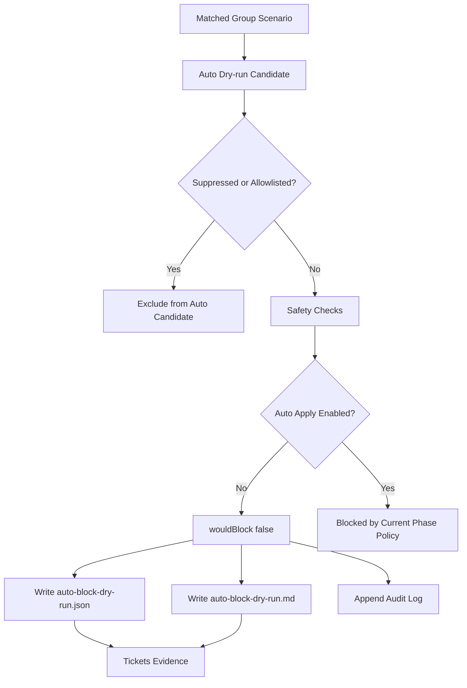

# WAF Scenario Evaluation Methodology



작성일: 2026-05-01

## 1. 목적

이 문서는 다음 목적을 위해 작성한다.

- `WAF-S001`~`WAF-S011` low-level scenario의 적합성을 평가한다.
- `WAF-G001`~`WAF-G008` group scenario의 운영 적합성을 평가한다.
- 해킹 공격을 더 정확히 식별하고, 향후 IP 자동 차단으로 확장하기 위한 평가 기준을 수립한다.
- 현재 단계가 실제 차단 적용 단계가 아니라 평가, 튜닝, dry-run 검증 단계임을 명시한다.

현재 정책 기준:

- `npm.cmd run plura:waf:auto`는 자동 IP 차단용 예약 명령이며 `DISABLED` 상태를 유지한다.
- `npm.cmd run plura:waf:auto:dry-run`은 별도 dry-run 평가 경로로 사용한다.
- 실제 IP 차단은 수행하지 않는다.

## 2. 평가 대상

### Low-level scenarios

- `WAF-S001`
- `WAF-S002`
- `WAF-S003`
- `WAF-S004`
- `WAF-S005`
- `WAF-S006`
- `WAF-S007`
- `WAF-S008`
- `WAF-S009`
- `WAF-S010`
- `WAF-S011`

### Group scenarios

- `WAF-G001`
- `WAF-G002`
- `WAF-G003`
- `WAF-G004`
- `WAF-G005`
- `WAF-G006`
- `WAF-G007`
- `WAF-G008`

## 3. 평가 관점 정의

### 정확성 Accuracy

- 실제 공격을 얼마나 잘 식별하는가
- 오탐 가능성과 미탐 가능성이 어느 정도인가
- raw log, row evidence, TI, AI, sequence evidence와 정합적인가

### 효과성 Effectiveness

- IP 차단 검토 또는 대응 우선순위 선정에 실질적으로 도움이 되는가
- 보안 담당자가 “지금 봐야 하는 이벤트”를 좁히는 데 유용한가
- 수동 차단 검토, 보고서 강조, dry-run 후보 선정에 기여하는가

### 운영성 Operability

- 관제자가 이해하고 설명할 수 있는가
- Gmail, report, overlay, tickets publish에서 설명 가능한가
- “왜 이 시나리오가 매칭되었는지”를 사람이 추적할 수 있는가

### 안전성 Safety

- allowlist, suppression과 잘 결합되는가
- 내부 IP, 고객 허용 IP, 검색엔진, 모니터링 IP를 잘 배제할 수 있는가
- 정상 IP 차단 위험을 줄이는 방향으로 동작하는가

### 차별성 Distinctiveness

- 다른 시나리오와 지나치게 중복되지 않는가
- 독립적인 판단 가치가 있는가
- representative scenario나 representative group scenario로서 의미가 있는가

### 확장성 Maintainability

- JSON config로 관리 가능한가
- 고객사별 튜닝이 가능한가
- fixture, test, policy 검증으로 지속적으로 검토 가능한가

## 4. 점수 체계

각 항목은 `1`~`5`점으로 평가한다.

- `5점`: 운영 적용 적합
- `4점`: 일부 튜닝 후 운영 적합
- `3점`: 보조 근거로 적합
- `2점`: report-only 또는 조건부 사용
- `1점`: 보류 또는 재설계 필요

권장 가중치:

- 정확성 `30%`
- 효과성 `25%`
- 운영성 `20%`
- 안전성 `15%`
- 차별성 `5%`
- 확장성 `5%`

최종 점수 계산 예:

```text
totalScore =
accuracy * 0.30 +
effectiveness * 0.25 +
operability * 0.20 +
safety * 0.15 +
distinctiveness * 0.05 +
maintainability * 0.05
```

권장 해석:

- `4.5 ~ 5.0`: 운영 적용 우선 후보
- `3.5 ~ 4.4`: 튜닝 후 운영 적용 가능
- `2.5 ~ 3.4`: 보조 근거 또는 제한적 운영
- `1.5 ~ 2.4`: report-only 또는 near-threshold 참고
- `1.0 ~ 1.4`: 보류 또는 재설계 검토

## 5. WAF-S001~S011 평가 표 템플릿

| Scenario | 목적 | 현재 조건 | 주요 근거 데이터 | Accuracy | Effectiveness | Operability | Safety | Distinctiveness | Maintainability | Weighted Score | 운영 판단 | 조정 후보 |
|---|---|---|---|---:|---:|---:|---:|---:|---:|---:|---|---|
| WAF-S001 |  |  |  |  |  |  |  |  |  |  |  |  |
| WAF-S002 |  |  |  |  |  |  |  |  |  |  |  |  |
| WAF-S003 |  |  |  |  |  |  |  |  |  |  |  |  |
| WAF-S004 |  |  |  |  |  |  |  |  |  |  |  |  |
| WAF-S005 |  |  |  |  |  |  |  |  |  |  |  |  |
| WAF-S006 |  |  |  |  |  |  |  |  |  |  |  |  |
| WAF-S007 |  |  |  |  |  |  |  |  |  |  |  |  |
| WAF-S008 |  |  |  |  |  |  |  |  |  |  |  |  |
| WAF-S009 |  |  |  |  |  |  |  |  |  |  |  |  |
| WAF-S010 |  |  |  |  |  |  |  |  |  |  |  |  |
| WAF-S011 |  |  |  |  |  |  |  |  |  |  |  |  |

컬럼 작성 기준:

- `현재 조건`: threshold, timeWindow, similarity key, custom filter config 등
- `주요 근거 데이터`: attacker IP, severity count, unique paths, TI, AI, sequence, distributed IP count 등
- `운영 판단`: keep, tune, report-only, support-only, near-threshold 참고 등
- `조정 후보`: threshold 조정, suppression 강화, parser 품질 개선, evidence 보강 등

## 6. WAF-G001~G008 평가 표 템플릿

| Group | Mapping Sxxx | 운영 목적 | Gmail 적합성 | Overlay 적합성 | Report-only 여부 | Auto 후보 여부 | Accuracy | Effectiveness | Operability | Safety | Weighted Score | 운영 판단 | 조정 후보 |
|---|---|---|---|---|---|---|---:|---:|---:|---:|---:|---|---|
| WAF-G001 |  |  |  |  |  |  |  |  |  |  |  |  |  |
| WAF-G002 |  |  |  |  |  |  |  |  |  |  |  |  |  |
| WAF-G003 |  |  |  |  |  |  |  |  |  |  |  |  |  |
| WAF-G004 |  |  |  |  |  |  |  |  |  |  |  |  |  |
| WAF-G005 |  |  |  |  |  |  |  |  |  |  |  |  |  |
| WAF-G006 |  |  |  |  |  |  |  |  |  |  |  |  |  |
| WAF-G007 |  |  |  |  |  |  |  |  |  |  |  |  |  |
| WAF-G008 |  |  |  |  |  |  |  |  |  |  |  |  |  |

컬럼 작성 기준:

- `Mapping Sxxx`: 해당 group이 소비하는 low-level scenario
- `Gmail 적합성`: operator-facing alert로서 메일 제목과 본문에 적합한가
- `Overlay 적합성`: 브라우저 overlay나 guide 설명으로 적합한가
- `Report-only 여부`: 실제 operator action보다 보고용 근거에 가까운가
- `Auto 후보 여부`: 현재는 dry-run 관점에서만 평가하며 실제 auto apply는 별도 승인 전제

## 7. 현재 시나리오별 1차 평가 의견

### WAF-S001

- VT/TI 기반으로 신뢰도는 높지만 실제 API 연동, 캐시, 쿼터, private IP 제외가 필요하다.
- 단독 차단 근거보다는 보조 근거로 적합하다.
- `WAF-G007`과 함께 operator-facing 보강 근거로 쓰는 방향이 안전하다.

### WAF-S002

- Low 스캐닝은 소음 가능성이 크다.
- report-only 우선이 적절하다.
- Gmail, overlay 승격은 제한적으로 검토하는 편이 안전하다.

### WAF-S003

- Middle 반복 스캐닝 시나리오다.
- threshold `20`은 유지 검토 대상이다.
- report 또는 near-threshold 근거로는 유용하지만 단독 operator 승격은 신중해야 한다.

### WAF-S004

- High 반복 스캐닝은 수동 차단 검토 후보로 적합하다.
- 반복성, unique path, 차단 포함 여부를 함께 보이면 운영 가치가 높다.

### WAF-S005

- Critical 반복 스캐닝은 강한 후보다.
- `2/3`, `3/3` 기준 운영 판단을 어떻게 둘지 추가 검토가 필요하다.
- allowlist 통과와 내부 진단 IP 제외가 전제되어야 한다.

### WAF-S006

- 비스캐닝 Critical 단건은 `RCE`, `WebShell`, `LFI`, `SQLi` 등과 연결될 경우 수동 차단 안내 후보가 된다.
- raw evidence가 충분할수록 설명 가능성이 높다.

### WAF-S007

- 고객사 커스텀 필터는 운영 가치가 높다.
- 단건 매칭이 누적될 경우 피로도가 발생할 수 있다.
- `matchedEvents` 또는 `blocked` 조건을 추가로 검토할 가치가 있다.

### WAF-S008

- AI 악성 확률은 단독 판단보다 다른 시나리오를 보강하는 용도가 적합하다.
- priority boost 또는 supporting evidence로 보는 편이 안전하다.

### WAF-S009

- 공격 시퀀스는 PLURA-XDR AI Agent의 차별점이 큰 영역이다.
- `probe -> admin -> exploit` 흐름은 operator-facing 설명력이 높다.
- Gmail, overlay, report 모두에 적합하다.

### WAF-S010

- 복합 공격 유형은 현재 대표성이 높다.
- 단일 row에 복수 classification이 포함되어 matched 될 수 있으므로 group 승격 조건은 별도로 조정해야 한다.
- `totalEvents >= 2` 조건 검토가 타당하다.

### WAF-S011

- 분산 유사 공격은 봇넷, 프록시, 다수 소스 공격 대응에 중요하다.
- `distinctIps`, `timeWindow`, `similarAttackKey` 정교화가 핵심이다.
- NAT, CDN, shared egress 예외 설계가 반드시 뒤따라야 한다.

## 8. Group scenario 평가 의견

### WAF-G001

- 반복 스캐닝 그룹이다.
- Low, Middle은 기본적으로 report-only가 적절하다.
- High, Critical은 overlay 후보로 승격 가능하다.
- severity별 정책 분리가 필요하다.

### WAF-G002

- 고위험 단건 공격 그룹이다.
- 수동 차단 안내 후보로 적합하다.
- allowlist, suppression은 필수다.

### WAF-G003

- 고객사 중요 필터 그룹이다.
- 조건부 Gmail, overlay에 적합하다.
- 단건 매칭 피로도를 계속 검토해야 한다.

### WAF-G004

- 공격 시퀀스 그룹이다.
- Gmail, overlay 적합성이 높다.
- auto 후보는 장기 검토 항목으로 두는 것이 맞다.

### WAF-G005

- 복합 공격 유형 그룹이다.
- Gmail, overlay 모두 적합하다.
- `distinctAttackTypes >= 2 AND totalEvents >= 2` 조건이 권장된다.

### WAF-G006

- 분산 유사 공격 그룹이다.
- Gmail, overlay 적합성이 높다.
- 유사도 품질과 distributed correlation tuning이 중요하다.

### WAF-G007

- 외부 평판, TI 보강 그룹이다.
- 보조 근거로는 적합하다.
- 단독 auto 후보로 사용하면 안 된다.

### WAF-G008

- AI 분석 보강 그룹이다.
- 보조 판단 또는 priority boost 용도로 적합하다.
- 단독 차단 근거로 쓰기에는 아직 이르다.

## 9. 자동 차단 적용 전 필수 조건

실제 auto apply를 검토하기 전에 최소한 아래 조건이 만족되어야 한다.

- auto dry-run에서 충분한 검증이 누적될 것
- allowlist, suppression이 기본 경로에 적용될 것
- 내부 IP, 고객 허용 IP가 제외될 것
- 검색엔진, 모니터링 IP가 제외될 것
- run당 최대 차단 IP 수 제한이 있을 것
- TTL 기반 차단 해제 정책이 있을 것
- audit log가 남을 것
- rollback 절차가 준비될 것
- 승인 정책이 정의될 것
- 고객사별 정책 분리가 가능할 것
- dry-run 결과와 실제 차단 결과를 비교하는 검증 루프가 있을 것

추가로 현재 단계에서 지켜야 할 원칙:

- `plura:waf:auto`는 계속 `DISABLED` 상태를 유지한다.
- 실제 IP 차단은 수행하지 않는다.
- 수동차단 버튼 자동 클릭, 저장, 등록, 확인 클릭은 금지한다.
- `G007`, `G008`은 단독 auto 근거로 사용하지 않는다.

## 10. 산출물과 후속 작업

이 문서는 “평가 방법론”을 정의하는 산출물이며, 실제 점수 입력과 tuning 작업은 후속 단계에서 진행한다.

후속 작업:

1. 각 `S001`~`S011`에 실제 점수 입력
2. 각 `G001`~`G008`에 실제 점수 입력
3. fixture 기반 false positive 케이스 추가
4. live `manual:all` 결과 누적
5. `WAF-G005`, `WAF-G003` 우선 튜닝
6. auto dry-run 결과와 시나리오 점수 비교
7. auto apply는 별도 승인 후 진행

## 부록: 평가 기록 작성 원칙

- threshold, priorityScore, auto mode 동작을 문서 작성 단계에서 임의 변경하지 않는다.
- 문서 평가는 현재 구현 상태를 설명하는 용도로 사용한다.
- score 입력 시 fixture 결과, live manual 결과, suppression 결과를 함께 남긴다.
- “운영 적용 적합” 판정을 받더라도 실제 차단 전에는 dry-run 누적 검증이 먼저다.
