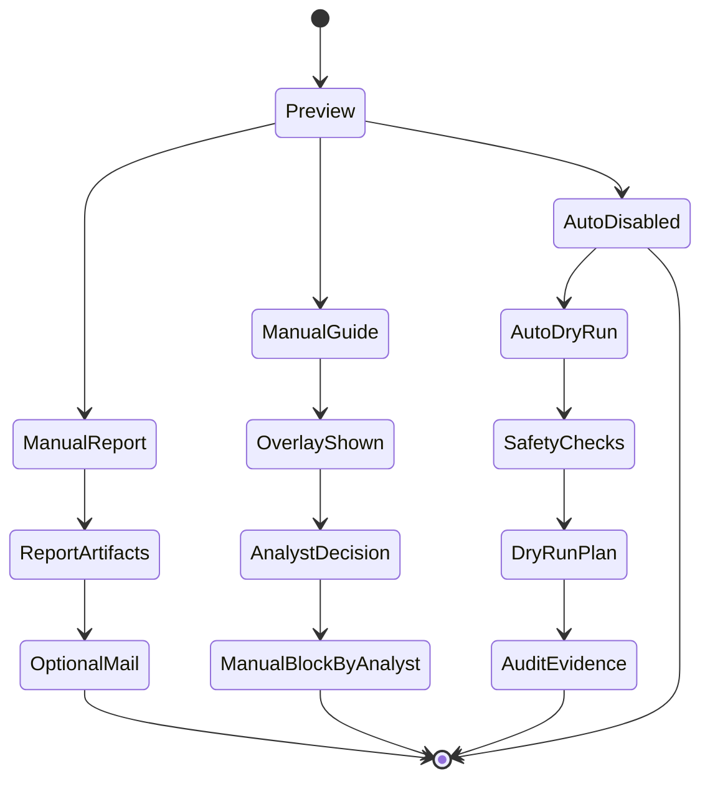
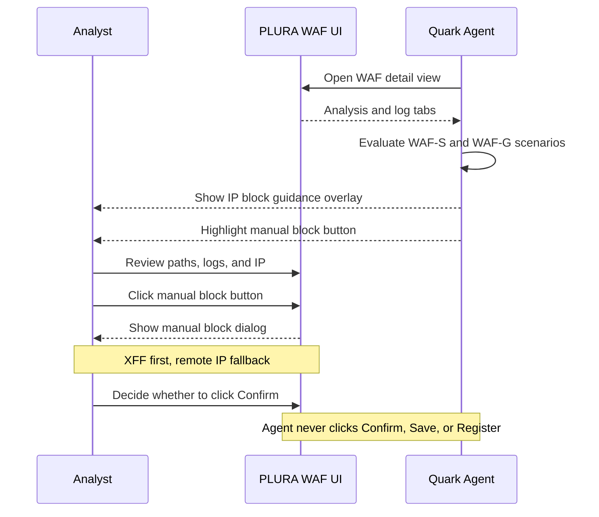

# WAF Scenario Management

이 문서는 WAF scenario 설정 파일과 운영 문서를 어떻게 관리할지 정리한 기준이다. 이번 문서는 문서 작업만 다루며, scenario 조건, threshold, priorityScore, Gmail 발송 로직, overlay 로직, auto mode 동작은 직접 변경하지 않는다.

## 1. Files

| File | Role | Notes |
|---|---|---|
| `config/scenarios/waf.scenarios.json` | `WAF-Sxxx` low-level detection rule 정의 | 실제 탐지 규칙과 fixture, test가 함께 움직여야 한다. |
| `config/scenarios/waf.group-scenarios.json` | `WAF-Gxxx` operator-facing group scenario 정의 | 여러 low-level rule을 운영자용 판단으로 묶는다. |
| `config/scenarios/waf.custom-filters.json` | 고객사별 custom filter rule | `WAF-S007`, `WAF-G003`과 직접 연결된다. |
| `config/scenarios/waf.allowlist.json` | allowlist and suppression 정책 | 내부 IP, 허용 IP, 검색엔진, 모니터링 예외를 관리한다. |
| `config/scenarios/waf.scenario-changelog.md` | scenario 변경 이력 | threshold, priority, eligibility, enabled 상태 변경을 기록한다. |

## 2. Layering

`WAF-Sxxx`는 low-level evidence 계층이다. 개별 이벤트, 반복 스캐닝, critical single attack, custom filter, attack sequence, mixed attack types, distributed attack 같은 근거를 계산한다.

`WAF-Gxxx`는 operator-facing response 계층이다. 보고서, Gmail 제목, manual overlay, auto dry-run 설명은 `WAF-Gxxx` 중심으로 보여 주고, `WAF-Sxxx`는 supporting evidence로 남긴다.

## 3. Mode Overview

핵심 해석:

- `plura:waf:manual:all`은 report artifact 중심이다.
- `plura:waf:manual:guide`는 overlay와 manual guidance 중심이다.
- `plura:waf:auto`는 계속 `DISABLED` 상태를 유지한다.
- `plura:waf:auto:dry-run`만 safety check와 candidate evidence를 남긴다.

## 4. Manual Guide Flow

이 흐름에서 자동화는 분석과 안내만 수행한다. 실제 차단, 저장, 등록, 확인은 항상 분석가가 직접 판단한다.

## 5. Change Workflow

| Step | Description | Required Output |
|---|---|---|
| draft | 운영 목적, 입력 데이터, 기본 판단 조건, false positive 위험을 먼저 문서화한다. | review 문서 또는 issue 초안 |
| fixture | live 데이터를 무해하게 재현 가능한 fixture를 추가한다. | `fixtures/waf/scenario-xxx-*.json` |
| test | scenario engine에 match, no-match, boundary case를 추가한다. | `npm.cmd run test:waf:scenarios` 통과 |
| review | report, Gmail, overlay, auto dry-run 적합성을 검토한다. | docs와 changelog 업데이트 |
| enabled | 운영 확인 후 `enabled=true`로 전환한다. | config, fixture, test, docs, changelog 일치 |

## 6. JSON Guidance

| Field | Purpose | Guidance |
|---|---|---|
| `id` | 내부 식별자 | low-level은 숫자, group은 `Gxxx` 형식을 사용한다. |
| `code` | 표시 코드 | `WAF-S001`, `WAF-G001` 형식을 유지한다. |
| `name` | 운영자용 이름 | 보고서와 overlay에서 읽기 쉬운 짧은 이름을 쓴다. |
| `enabled` | 평가 대상 여부 | disabled rule은 기본 평가에서 제외한다. |
| `priorityScore` | 대표 선정 점수 | 높을수록 representative scenario 우선순위가 높다. |
| `actionMode` | 기본 운영 모드 | `report-only`, `manual-guidance`, `manual-review`, `disabled`를 사용한다. |
| `gmailEligible` | Gmail 후보 여부 | 실제 발송 여부는 별도 정책과 env가 결정한다. |
| `overlayEligible` | overlay 후보 여부 | guide mode에서만 의미가 있다. |
| `autoEligible` | auto 후보 여부 | 현재 실제 auto apply는 사용하지 않는다. |
| `conditions` | 매칭 조건 | threshold, time window, mapped scenario, field pattern을 명시한다. |
| `recommendation` | 운영 권고 | 수동 확인, 수동 차단 검토, report-only 이유를 기록한다. |
| `review` | 검토 메모 | 오탐 위험, 중복 가능성, safety note를 남긴다. |

## 7. Validation Checklist

- config 수정 여부 확인
- fixture 추가 또는 갱신 확인
- docs 업데이트 확인
- `config/scenarios/waf.scenario-changelog.md` 갱신
- `npm.cmd run check`
- 필요 시 `npm.cmd run test:waf:scenarios`
- 필요 시 `npm.cmd run plura:waf:manual:all`
- 필요 시 `npm.cmd run plura:waf:auto:dry-run`

문서만 변경할 때는 `npm.cmd run check`를 최소 검증으로 사용한다.

## 8. Safety Rules

- 실제 IP 차단 금지
- 수동차단 버튼 자동 클릭 금지
- 저장, 등록, 확인 버튼 자동 클릭 금지
- Gmail 발송 로직 임의 변경 금지
- allowlist와 suppression 우회 금지
- 계정, SMTP 비밀번호, API key 같은 민감정보 기록 금지
- `src/pluraAgent.ts`, `src/runMitre.ts`는 WAF 문서 작업과 무관하게 수정하지 않는다

## 9. Schema Preparation

향후 JSON schema를 넣을 때는 아래 파일을 기준으로 확장한다.

- `config/scenarios/schema/waf.scenarios.schema.json`
- `config/scenarios/schema/waf.group-scenarios.schema.json`
- `config/scenarios/schema/waf.custom-filters.schema.json`
- `config/scenarios/schema/waf.allowlist.schema.json`

초기 schema는 필수 필드, `autoEligible=false` 기본값, `code` naming convention, `priorityScore` 범위, `mappedScenarioIds` 존재 여부부터 검증하는 방향이 적절하다.
