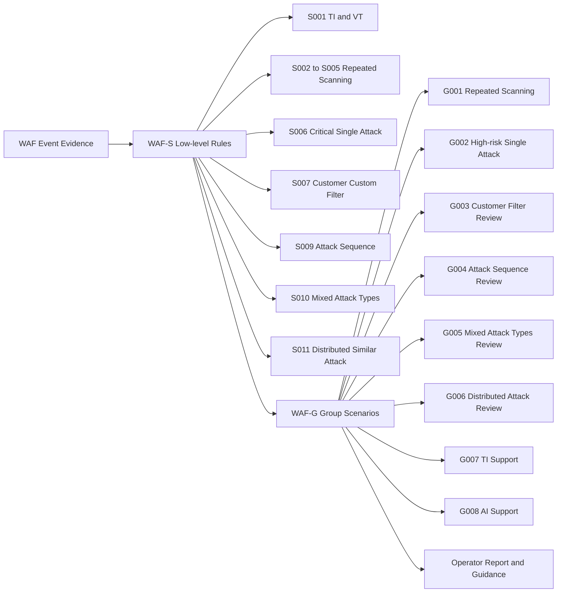

# WAF Scenario Redesign

작성일: 2026-04-30

이 문서는 현재 구현된 `WAF-S001` ~ `WAF-S011`의 운영 적합성을 재검토하고, 이를 기반으로 관제자가 이해하기 쉬운 운영형 group scenario 체계를 설계하기 위한 초안이다. 이 단계에서는 기존 threshold, priorityScore, auto mode 동작을 변경하지 않는다.

## 1. Existing Scenario Review

| scenarioId | code | 현재 목적 | 현재 threshold | 현재 priorityScore | live manual:all 결과 | 장점 | 오탐 가능성 | 중복 가능성 | Gmail 발송 적합성 | manual overlay 적합성 | auto 후보 여부 | 판단 | 권장 조정안 |
|---:|---|---|---|---:|---|---|---|---|---|---|---|---|---|
| 1 | WAF-S001 | VT/TI 악성 평판 기반 IP 검토 | `maliciousRate >= 0.05` | 90 | 미매칭, VT 결과 없음 | 외부 평판 근거가 명확함 | 중간. NAT, 공유 IP, 오래된 평판 가능 | S008, S009, S010과 결합 가능 | 단독보다 보강 근거로 적합 | 평판 근거가 있을 때 적합 | 장기 검토 | 유지 | API 호출, 캐시, 쿼터, 분석 시점, allowlist를 갖춘 뒤 운영 반영 |
| 2 | WAF-S002 | Low 스캐닝 반복 탐지 | `LOW >= 30` | 30 | 미매칭, Low 기준 미달 | 낮은 위험 반복 노이즈를 추적 가능 | 높음. 검색엔진/모니터링/정상 크롤링 가능 | S003~S005와 구조 중복 | 낮음. report-only 우선 | 낮음 | 없음 | 병합 | 반복 스캐닝 group으로 병합하고 Low는 보조 지표화 |
| 3 | WAF-S003 | Middle 스캐닝 반복 탐지 | `MIDDLE >= 20` | 40 | 미매칭, `12/20` | 반복 공격을 안정적으로 잡음 | 중간. crawler/진단 트래픽 가능 | S002, S004, S005와 중복 | 조건부 적합 | 조건부 적합 | 없음 | 병합 | 반복 스캐닝 group의 severity별 조건으로 유지 |
| 4 | WAF-S004 | High 스캐닝 반복 탐지 | `HIGH >= 10` | 50 | 미매칭, `3/10` | 고위험 반복을 구분 가능 | 중간 | S003, S005와 중복 | 조건부 적합 | 적합 | 장기 검토 | 병합 | 반복 스캐닝 group 안에서 High 조건으로 유지 |
| 5 | WAF-S005 | Critical 스캐닝 반복 탐지 | `CRITICAL >= 3` | 65 | 미매칭, `2/3` | Critical 반복의 운영 우선순위가 높음 | 중간. 스캐너 Critical 분류 과대 가능 | S006, S010과 일부 중복 | 적합 | 적합 | 장기 검토 | 병합/유지 | 반복 스캐닝 group에 포함하되 Critical 근접 상태를 report에 표시 |
| 6 | WAF-S006 | 비스캐닝 Critical 단건 검토 | non-scanner `CRITICAL >= 1` | 70 | 미매칭, 비스캐닝 Critical 없음 | 단건 고위험 공격을 놓치지 않음 | 중간. 룰 분류 오류 가능 | S005와 Critical 계열 중복 | 조건부 적합 | 적합 | 장기 검토 | 유지 | S005와 분리 유지. scanning/non-scanning 증거를 명확히 표시 |
| 7 | WAF-S007 | 고객사 커스텀 필터 매칭 | `waf.custom-filters.json` | 55 | 매칭, WordPress 백도어 패턴 | 고객사 운영 정책 반영 가능 | 설정 품질에 따라 변동 | S006, S010과 결합 가능 | 적합 | 적합 | 장기 검토 | 유지 | 단건 피로도 발생 시 `matchedEvents`, blocked 여부, severity metadata 추가 검토 |
| 8 | WAF-S008 | AI 악성 확률 기반 검토 | `maliciousProbability >= 0.7` | 75 | 미매칭, AI 분석 결과 없음 | 자연어/복합 증거 판단 보강 가능 | 중간~높음. 모델/룰 근거 품질 의존 | S001, S006, S009, S010과 결합 가능 | 단독 부적합, 결합 시 적합 | 보조 근거로 적합 | 없음 | 보류/재정의 | 단독 차단 근거가 아니라 보강 신호로 재정의 |
| 9 | WAF-S009 | 공격 시퀀스 기반 판단 | `probe -> admin-access -> exploit`, 30분 | 80 | 미매칭, admin-access phase 없음 | 공격 흐름 설명력이 높음 | 낮음~중간. phase 오분류 가능 | S010과 결합 가능 | 적합 | 적합 | 장기 검토 | 유지 | no-match reason과 sequence evidence를 계속 강화 |
| 10 | WAF-S010 | 동일 IP 복수 공격 유형 혼합 | `distinctAttackTypes >= 2` | 60 | 매칭, 대표 시나리오 | live 반복 행위 설명력이 높음 | 중간. 룰 파싱이 과분류될 수 있음 | S003, S005, S007, S009와 중복 | 적합 | 적합 | 없음 | 유지 | 최소 이벤트 수, uniquePaths 조건을 함께 검토 |
| 11 | WAF-S011 | 짧은 시간 내 분산 유사 공격 탐지 | `distinctIps >= 5`, 10분 | 85 | manual:all 1~10 범위 밖, 별도 검증 미매칭 | 봇넷/프록시 공격 탐지 가능 | 중간. CDN/NAT/공유 스캐너 가능 | S009, S010과 관점이 다름 | 적합 | 적합 | 장기 검토 | 유지 | targetDomain, path/query pattern 유사도와 시간창 튜닝 필요 |

## 2. Scenario Role Classification

`WAF-Sxxx`는 탐지 근거를 계산하는 low-level 계층이고, `WAF-Gxxx`는 그 근거를 운영자가 이해하기 쉬운 response scenario로 재구성하는 계층이다. 보고서, Gmail, overlay, auto dry-run 설명은 기본적으로 `WAF-Gxxx`를 중심으로 하고 `WAF-Sxxx`는 상세 evidence로 남긴다.

| role | scenarios | 설명 |
|---|---|---|
| 외부 평판 기반 | WAF-S001 | VirusTotal 또는 TI 결과를 입력으로 받아 악성 평판을 검토한다. |
| 단일 IP 반복 스캐닝 기반 | WAF-S002, WAF-S003, WAF-S004, WAF-S005 | 동일 IP의 severity별 반복 스캐닝 횟수를 평가한다. |
| 고위험 단건 기반 | WAF-S006 | 스캐닝성 반복이 아니더라도 비스캐닝 Critical 단건을 검토한다. |
| 고객사 커스텀 필터 기반 | WAF-S007 | 고객사 또는 그룹별 중요 필터 매칭 여부를 평가한다. |
| 공격 시퀀스 기반 | WAF-S009 | 시간순 로그 흐름에서 probe, admin 접근, exploit payload 단계가 이어지는지 본다. |
| 복수 공격 유형 기반 | WAF-S010 | 동일 IP에서 여러 공격 유형 또는 위험도가 혼합되는지 평가한다. |
| 분산 유사 공격 기반 | WAF-S011 | 유사 공격이 짧은 시간 안에 여러 IP에서 발생하는지 평가한다. |
| AI 보조 판단 기반 | WAF-S008 | AI 또는 rule-based 분석 확률을 단독 판단이 아닌 보강 근거로 사용한다. |

## 3. Merge And Keep Candidates

- `WAF-S002` ~ `WAF-S005`는 severity별 threshold만 다른 반복 스캐닝 계열이다. 운영 화면에서는 하나의 반복 스캐닝 group scenario로 병합하고, low-level evidence에는 severity별 count를 유지하는 방식이 적합하다.
- `WAF-S006`과 `WAF-S005`는 모두 Critical 계열이지만, `WAF-S005`는 scanner 반복, `WAF-S006`은 non-scanning 단건이라는 운영 의미가 다르므로 분리 유지한다.
- `WAF-S007`은 고객사 정책이므로 별도 유지한다. 다만 단건 커스텀 필터만으로 operator fatigue가 커질 경우 최소 이벤트 수 또는 blocked 조건을 추가 검토한다.
- `WAF-S008`은 단독 차단 또는 단독 high-priority alert보다 보조 판단으로 재정의하는 것이 안전하다.
- `WAF-S009`와 `WAF-S010`은 모두 공격 흐름을 설명하지만 관점이 다르다. `WAF-S009`는 시간순 sequence, `WAF-S010`은 공격 유형 다양성이므로 둘 다 유지하되 대표 시나리오 우선순위는 운영 데이터로 재검토한다.
- `WAF-S011`은 분산 공격 전용으로 유지한다. 단일 IP 중심 시나리오와 직접 병합하지 않는다.

## 4. New Operational Group Scenarios

| group code | 목적 | 기존 mapping | 입력 데이터 | 판단 조건 | manual guidance | Gmail 발송 | auto 후보 | 추가 안전장치 | fixture 테스트 |
|---|---|---|---|---|---|---|---|---|---|
| WAF-G001 | 반복 스캐닝 기반 IP 차단 검토 | S002, S003, S004, S005 | row list, attackerIp, classification/risk, path, detectedAt | severity별 count 중 하나가 threshold 이상이거나 Critical 근접 + 다른 group과 결합 | 조건부 yes | 조건부 yes. Low 단독은 no | 없음 | allowlist, trusted crawler suppression, 최소 uniquePaths | 필요 |
| WAF-G002 | 고위험 단건 공격 검토 | S006 | detail row, classification/risk, detectionType, raw log | non-scanning Critical 1건 이상 | yes | 조건부 yes | 장기 검토 | raw log 증거, rule confidence, allowlist | 필요 |
| WAF-G003 | 고객사 중요 필터 검토 | S007 | group/customer, wafRuleName, path, config | customer rule match | yes | yes | 장기 검토 | rule owner, expiry, matchedEvents/blocked 조건 | 필요 |
| WAF-G004 | 공격 시퀀스 기반 검토 | S009 | time-sorted events, path, status, query, classification | probe -> admin-access -> exploit payload sequence within time window | yes | yes | 장기 검토 | phase evidence, timeWindow, same-IP validation | 필요 |
| WAF-G005 | 복합 공격 유형 검토 | S010 | attackerIp grouped rows, attackTypes, severities, uniquePaths | distinct attack types >= threshold and enough event/path evidence | yes | yes | 없음 | 최소 이벤트 수, parsing quality, suppression | 필요 |
| WAF-G006 | 분산 유사 공격 검토 | S011 | targetDomain, wafRuleName, path/query pattern, attackerIps, detectedAt | distinct IPs >= threshold within time window for similar attack key | yes | yes | 장기 검토 | CDN/NAT 제외, customer allowlist, similarity tuning | 필요 |
| WAF-G007 | 외부 평판/TI 보강 검토 | S001 | threatIntel/vtAnalysis, attackerIp | malicious rate >= threshold, fresh enough analysis | 보조 yes | 결합 시 yes | 없음 | API cache, quota, lastAnalysisDate, private/customer allowlist | 필요 |
| WAF-G008 | AI 분석 보강 검토 | S008 | aiAnalysis, probability, reasons, raw evidence | malicious probability >= threshold and concrete WAF evidence exists | 보조 yes | 결합 시 yes | 없음 | no standalone blocking, explainability, model/provider audit | 필요 |

## 5. Live Manual:all Evaluation Against Group Scenarios

Live input summary:

| item | value |
|---|---|
| attackerIp | `20.220.233.65` |
| totalEvents | `13` |
| blockedEvents | `2` |
| detectedEvents | `11` |
| uniquePaths | `13` |
| matchedScenarios | `[7, 10]` |
| representativeScenario | `WAF-S010` |
| S003 | Middle `12/20` |
| S004 | High `3/10` |
| S005 | Critical `2/3` |
| S007 | matched |
| S010 | matched |

Expected group scenario result:

| group code | expected result | reason |
|---|---|---|
| WAF-G001 | Not matched or near-match | Middle `12/20`, High `3/10`, Critical `2/3` are below current thresholds. It should be shown as repeated scanning evidence but not the representative reason. |
| WAF-G002 | Not matched | No non-scanning Critical single attack was confirmed. |
| WAF-G003 | Matched | Customer custom filter matched a WordPress backdoor path. |
| WAF-G004 | Not matched | Attack sequence is incomplete because admin-access phase was not found. |
| WAF-G005 | Matched | Same attacker IP produced multiple attack types, multiple severities, and 13 unique paths. |
| WAF-G006 | Not evaluated in 1-10 batch | Scenario 11 is outside `manual:all` 1-10 scope; separate `--scenario=11` or `--scenario=all` should evaluate distributed behavior. |
| WAF-G007 | Not matched | VT/TI result is not available. |
| WAF-G008 | Not matched | AI analysis result is not available. |

For this live batch, `WAF-G005` should be the representative operational scenario, with `WAF-G003` as supporting evidence. `WAF-G001` should appear as near-threshold repeated scanning evidence, especially because Critical scanning is `2/3`.

## 6. Recommended Implementation Sequence

1. Add an operational group scenario config while keeping `WAF-S001` ~ `WAF-S011` as low-level rules.
2. Implement `WAF-G001` ~ `WAF-G008` as group scenarios that consume low-level scenario results and row/detail evidence.
3. Keep report and overlay centered on group scenarios, not raw low-level rule IDs.
4. Display low-level scenario evidence as supporting detail under the representative group scenario.
5. Add fixture tests for each group scenario, including near-threshold and suppression cases.
6. Keep `plura:waf:auto` disabled until allowlist, approval, TTL, audit log, rollback, and dry-run accuracy policies are implemented and reviewed.
7. Run auto-block evaluation only through a separate `plura:waf:auto:dry-run` command until real auto apply is explicitly approved.
