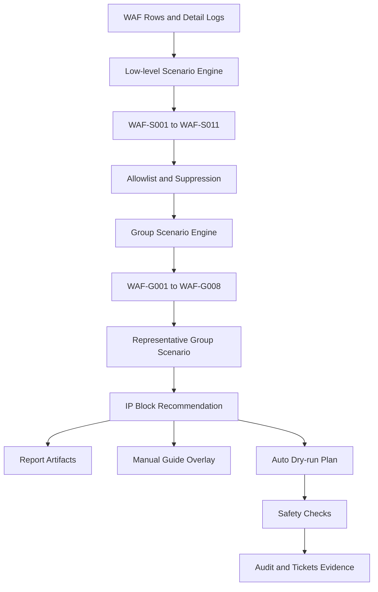
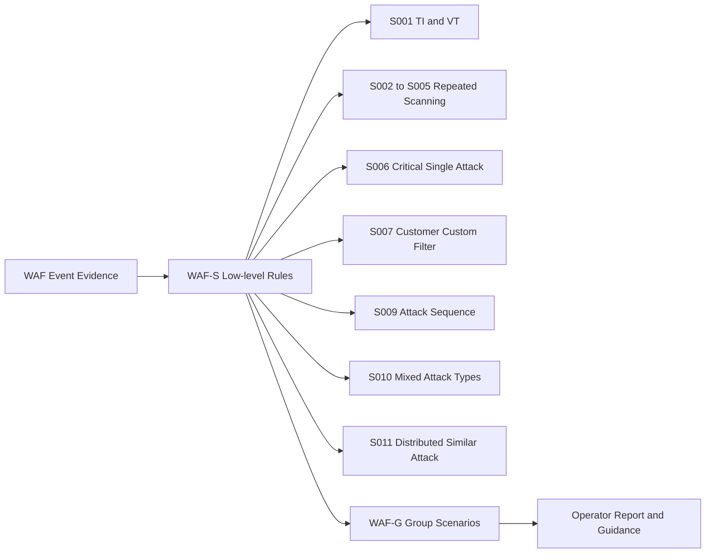
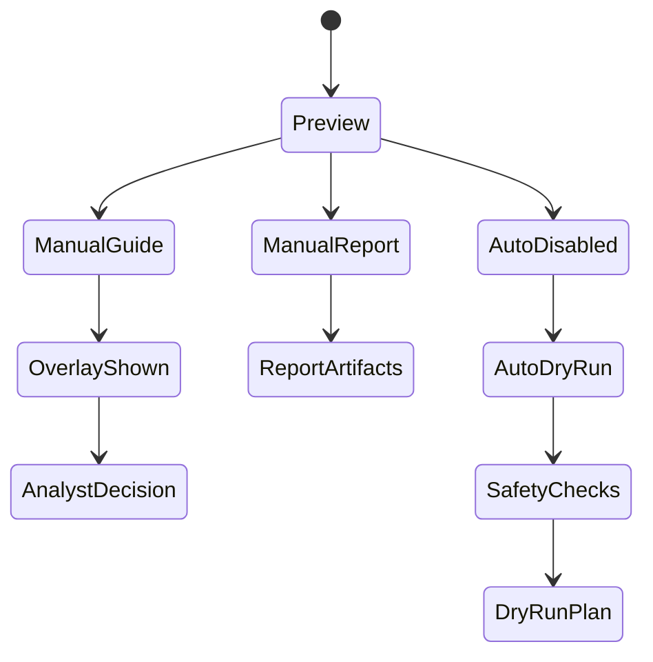
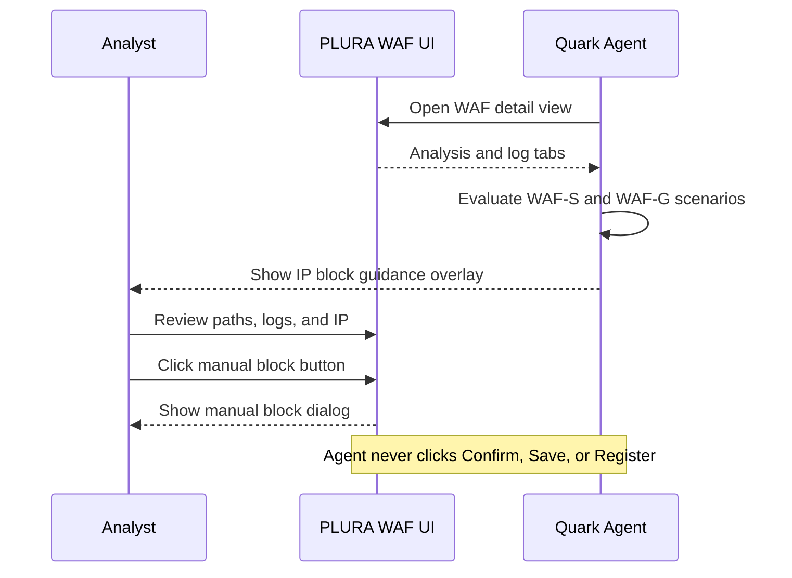
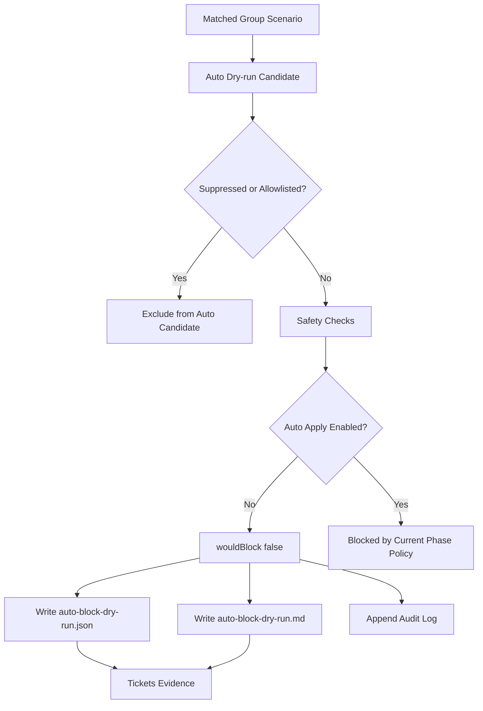

# WAF Scenario Diagrams

이 문서는 WAF 분석 흐름, WAF-S/WAF-G 역할 분리, manual guide, auto dry-run 흐름을 도식화한 문서입니다.

## 1. WAF 전체 분석 파이프라인

## 2. WAF-Sxxx and WAF-Gxxx 역할 분리

## 3. Manual Report, Guide, Auto Dry-run 모드 구조

## 4. 수동차단 Guide Mode 흐름

## 5. Auto Dry-run Safety Flow

