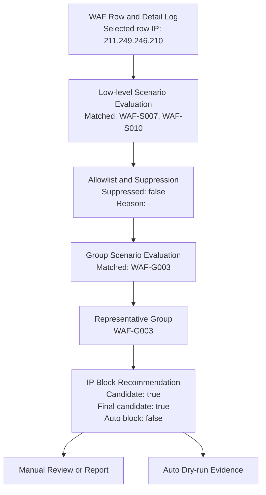
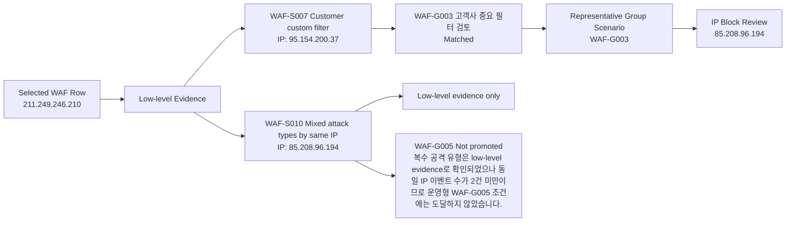
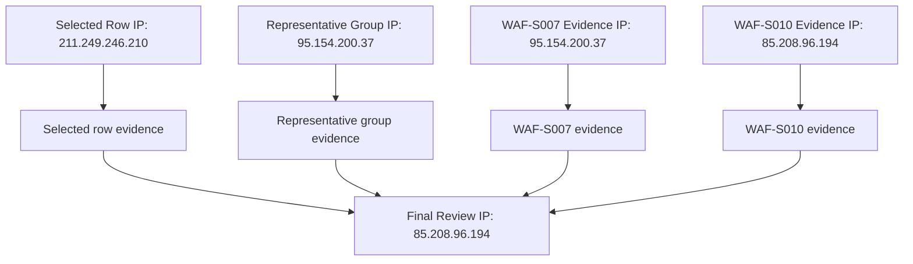

# WAF IP 차단 검토 필요

대표 운영형 시나리오: WAF-G003 고객사 중요 필터 검토. 공격자 IP 211.249.246.210에서 오늘 총 1개 정탐이 탐지되었습니다. 동일 IP에서 복수 공격 유형과 다수 경로가 함께 확인되어 IP주소 수동차단 검토가 필요합니다.

- 대표 운영형 시나리오: WAF-G003 고객사 중요 필터 검토
- 운영형 판단 사유: 고객사 커스텀 필터에 해당하는 중요 탐지가 확인되어 IP 차단 검토가 필요합니다.
- 상세 근거: WAF-S007, WAF-S010

## 분석 결과 요약

- 실행 상태: OK
- 조회 날짜: 오늘 / 2026-05-01 ~ 2026-05-01
- 공격자 IP: 211.249.246.210
- 총 이벤트 수: 1
- 차단 수: 0
- 탐지 수: 1
- 고유 경로 수: 1
- 사용자 수동 확인 대기: false
- 브라우저 유지: false
- 자동 IP 차단 수행: false
- 확인 대상 IP: -
- IP 차단 후보: true
- 발송 판단: 반복성 낮음 또는 발송 조건 미충족
- 종료 방법: -

## IP 차단 검토 안내

- 판단 이유: 대표 운영형 시나리오 WAF-G003 고객사 중요 필터 검토 매칭: 고객사 커스텀 필터에 해당하는 중요 탐지가 확인되어 IP 차단 검토가 필요합니다.
- 권고 조치: 웹 화면에서 해당 IP의 요청 경로와 탐지/차단 이력을 확인한 뒤 IP주소 차단을 검토하세요.
- 자동 차단 수행: false
- 수동차단 안내 활성화: false
- 브라우저 안내 overlay 표시: false
- 수동차단 버튼 위치 확인: false
- 수동차단 버튼 selector: -
- 수동차단 버튼 클릭: false
- 저장/확인 클릭: false
- 수동 IP 차단 매뉴얼: https://docs.plura.io/ko/v6/fn/comm/ipblock/manual

## Allowlist / Suppression

- suppressed: false
- action: -
- matchedRuleId: -
- matchedValue: -
- matchedField: -
- matchedIp: -
- reason: -
- result: allowlist suppression 미적용

## 매칭된 시나리오

- 선택: 1-11 => [1, 2, 3, 4, 5, 6, 7, 8, 9, 10, 11]
- matchedScenarios: [7, 10]
- matchedCount: 2
- representativeScenario: WAF-S010 Mixed attack types by same IP
- representativePriorityScore: 60
- representativeReason: 동일 IP 85.208.96.194에서 복수 공격 유형 또는 복수 위험도와 다수 경로가 함께 확인되었습니다.
- evaluatedScenarios: 11
- finalIpBlockCandidate: true
- autoBlock: false

## 탐지 판단 흐름도

## IP 근거 분리도

> 참고: 우선순위 row IP와 일부 scenario evidence IP가 다릅니다. 수동 차단 전 웹 화면에서 최종 차단 대상 IP를 반드시 확인하세요.

## 운영형 대표 시나리오

- matchedGroupScenarios: [WAF-G003]
- representativeGroupScenario: WAF-G003 고객사 중요 필터 검토
- representativeGroupPriorityScore: 65
- representativeGroupReason: 고객사 커스텀 필터에 해당하는 중요 탐지가 확인되어 IP 차단 검토가 필요합니다.
- representativeLowLevelScenario: WAF-S007

| group | priorityScore | matched | mapped | matchedLowLevel | reason |
|---|---:|---:|---|---|---|
| WAF-G001 반복 스캐닝 기반 IP 차단 검토 | 50 | false | 2, 3, 4, 5 | - | Mapped low-level scenarios did not match. |
| WAF-G002 고위험 단건 공격 검토 | 70 | false | 6 | - | Mapped low-level scenarios did not match. |
| WAF-G003 고객사 중요 필터 검토 | 65 | true | 7 | 7 | 고객사 커스텀 필터에 해당하는 중요 탐지가 확인되어 IP 차단 검토가 필요합니다. |
| WAF-G004 공격 시퀀스 기반 검토 | 85 | false | 9 | - | Mapped low-level scenarios did not match. |
| WAF-G005 복합 공격 유형 검토 | 80 | false | 10 | - | 복수 공격 유형은 low-level evidence로 확인되었으나 동일 IP 이벤트 수가 2건 미만이므로 운영형 WAF-G005 조건에는 도달하지 않았습니다. |
| WAF-G006 분산 유사 공격 검토 | 90 | false | 11 | - | Mapped low-level scenarios did not match. |
| WAF-G007 외부 평판/TI 보강 검토 | 75 | false | 1 | - | Mapped low-level scenarios did not match. |
| WAF-G008 AI 분석 보강 검토 | 60 | false | 8 | - | Mapped low-level scenarios did not match. |

| scenario | priorityScore | matched | attackerIp | reason |
|---|---:|---:|---|---|
| WAF-S001 VT malicious ratio | 90 | false | 211.249.246.210 | VT 분석 결과가 없어 수동차단 후보로 올리지 않습니다. |
| WAF-S002 Scanning Low threshold | 30 | false | - | 스캐닝성 LOW 이벤트가 기준 30건에 도달하지 않았습니다. |
| WAF-S003 Scanning Middle threshold | 40 | false | 85.208.96.209 | 스캐닝성 MIDDLE 이벤트가 기준 20건에 도달하지 않았습니다. |
| WAF-S004 Scanning High threshold | 50 | false | 85.208.96.209 | 스캐닝성 HIGH 이벤트가 기준 10건에 도달하지 않았습니다. |
| WAF-S005 Scanning Critical threshold | 65 | false | - | 스캐닝성 CRITICAL 이벤트가 기준 3건에 도달하지 않았습니다. |
| WAF-S006 Non-scanning Critical | 70 | false | - | 비스캐닝 CRITICAL 이벤트가 확인되지 않았습니다. |
| WAF-S007 Customer custom filter | 55 | true | 95.154.200.37 | 고객사 커스텀 필터에 해당하는 중요 탐지가 확인되어 IP 차단 검토가 필요합니다. |
| WAF-S008 AI malicious probability | 75 | false | 185.191.171.7 | AI 분석 결과가 없어 수동차단 후보로 올리지 않습니다. |
| WAF-S009 Threat sequence judgment | 80 | false | 85.208.96.209 | 로그 순서 기반 위협 시퀀스가 확인되지 않았습니다. |
| WAF-S010 Mixed attack types by same IP | 60 | true | 85.208.96.194 | 동일 IP 85.208.96.194에서 복수 공격 유형 또는 복수 위험도와 다수 경로가 함께 확인되었습니다. |
| WAF-S011 Distributed similar attack burst | 85 | false | 211.249.246.210 | 분산 유사 공격 기준에 도달하지 않았습니다. |

## 시나리오 상세 근거

### WAF-S007 Customer custom filter
- priorityScore: 55
- attackerIp: 95.154.200.37
- attackerIps: -
- reason: 고객사 커스텀 필터에 해당하는 중요 탐지가 확인되어 IP 차단 검토가 필요합니다.
- recommendation: 웹 화면에서 해당 IP의 요청 경로와 탐지/차단 이력을 확인한 뒤 IP주소 수동차단을 검토하세요.
- customer: WAF-Blog
- matchedRuleId: custom-waf-blog-critical-paths
- matchedPattern: 관리 도구 접근
- matchedField: wafRuleName
- matchedEvents: 1
- samplePaths: /wp-admin
- sampleFilters: 관리 도구 접근

### WAF-S010 Mixed attack types by same IP
- priorityScore: 60
- attackerIp: 85.208.96.194
- attackerIps: -
- reason: 동일 IP 85.208.96.194에서 복수 공격 유형 또는 복수 위험도와 다수 경로가 함께 확인되었습니다.
- recommendation: 웹 화면에서 해당 IP의 요청 경로와 탐지/차단 이력을 확인한 뒤 IP주소 수동차단을 검토하세요.
- evidence: {"threshold":2,"totalEvents":1,"distinctAttackTypes":2,"attackTypes":["SCANNER","INJECTION"],"severities":["MIDDLE"],"uniquePaths":1,"samplePaths":["/ko/threats/webshell_create_function_vulnerability/"]}

## 최종 IP 차단 검토 사유

최종 IP 차단 검토 사유: WAF-S007 고객사 커스텀 필터에 해당하는 중요 탐지가 확인되어 IP 차단 검토가 필요합니다. / WAF-S010 동일 IP 85.208.96.194에서 복수 공격 유형 또는 복수 위험도와 다수 경로가 함께 확인되었습니다. 자동 IP 차단은 수행하지 않으며 담당자가 웹 화면에서 수동 확인 후 결정합니다.

## 반복 요청 경로

| path |
|---|
| /ko/threats/webshell_create_function_vulnerability/ |

## 우선순위 차단 이벤트

- 공격자 IP: 211.249.246.210
- 대상 도메인: blog.plura.io
- 요청 Method: GET
- URI/path: /ko/threats/webshell_create_function_vulnerability/
- 쿼리/요청본문: -
- HTTP 상태값: 200
- 탐지/차단 유형: 탐지(OWASP)
- WAF 필터명: PHP 에러 노출
- 위험도/risk: -
- 탐지 시각: 2026-05-01 19:45:46.939
- 분석 탭 수집: true
- 로그 탭 수집: true

## 원본 로그 주요 필드

- method: GET
- uri: /ko/threats/webshell_create_function_vulnerability/
- host: blog.plura.io
- remoteIp: 211.249.246.210
- responseStatus: 200

## 담당자 확인 항목

1. 공격자 IP 211.249.246.210의 동일 시간대 반복 요청 전체 확인
2. 반복 경로가 PHP/WordPress 백도어/관리자 경로 스캔인지 확인
3. 탐지(OWASP)와 HTTP 200이 정상 차단 정책과 일치하는지 확인
4. 동일 IP의 후속 요청이 계속 발생하는지 확인
5. 웹 UI에서 IP주소 차단 등록 여부 결정