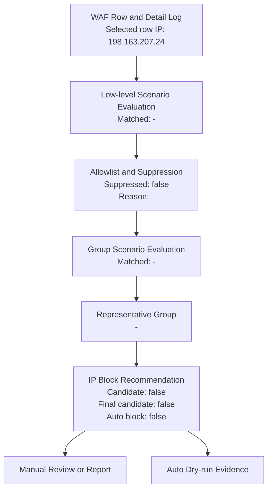
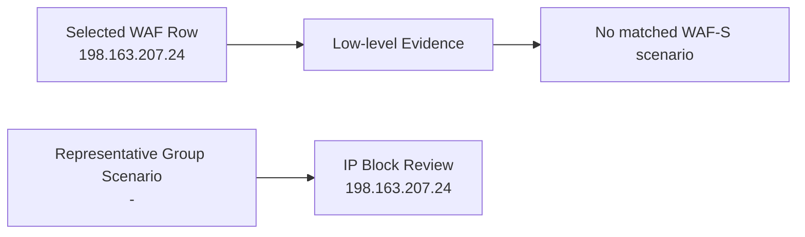
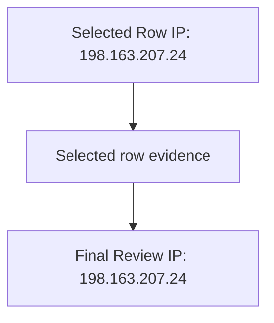

# WAF 분석 결과 요약

반복성 기준에 도달하지 않아 단건 WAF 차단 이벤트는 정상 차단 이벤트로 기록합니다.

- 대표 운영형 시나리오: -
- 운영형 판단 사유: -
- 상세 근거: -

## 분석 결과 요약

- 실행 상태: OK
- 조회 날짜: 오늘 / 2026-05-02 ~ 2026-05-02
- 공격자 IP: 198.163.207.24
- IP 차단 후보: 아니오
- 확인 대상 IP: 198.163.207.24
- IP 근거 불일치: false
- 총 이벤트 수: 18
- 차단 수: 4
- 탐지 수: 14
- 고유 경로 수: 18
- 사용자 수동 확인 대기: false
- 브라우저 유지: false
- 자동 IP 차단 수행: false
- 확인 대상 IP: 198.163.207.24
- IP 차단 후보: 아니오
- 발송 판단: 반복성 낮음 또는 발송 조건 미충족
- 종료 방법: -

## IP 차단 검토 안내

- 판단 이유: 선택한 시나리오 기준으로 차단 후보가 아닙니다. 일반 반복 IP fallback은 scenario 선택 실행에서는 적용하지 않았습니다.
- 권고 조치: 선택한 시나리오 결과를 기준으로 차단 후보에서 제외합니다. 일반 반복 IP fallback을 적용하려면 별도 include-fallback 정책을 검토하세요.
- 자동 차단 수행: false
- 수동차단 안내 활성화: false
- 브라우저 안내 overlay 표시: false
- 수동차단 버튼 위치 확인: false
- 수동차단 버튼 selector: -
- 수동차단 버튼 클릭: false
- 저장/확인 클릭: false
- 수동 IP 차단 매뉴얼: https://docs.plura.io/ko/v6/fn/comm/ipblock/manual

## Allowlist / Suppression

- suppressed: false
- action: -
- matchedRuleId: -
- matchedValue: -
- matchedField: -
- matchedIp: -
- reason: -
- result: allowlist suppression 미적용

## 매칭된 시나리오

- 선택: 1-11 => [1, 2, 3, 4, 5, 6, 7, 8, 9, 10, 11]
- matchedScenarios: []
- matchedCount: 0
- representativeScenario: -
- representativePriorityScore: -
- representativeReason: -
- evaluatedScenarios: 11
- finalIpBlockCandidate: false
- autoBlock: false

## 탐지 판단 흐름도

## IP 근거 분리도

## 운영형 대표 시나리오

- matchedGroupScenarios: []
- representativeGroupScenario: -
- representativeGroupPriorityScore: -
- representativeGroupReason: -
- representativeLowLevelScenario: -

| group | priorityScore | matched | mapped | matchedLowLevel | reason |
|---|---:|---:|---|---|---|
| WAF-G001 반복 스캐닝 기반 IP 차단 검토 | 50 | false | 2, 3, 4, 5 | - | Mapped low-level scenarios did not match. |
| WAF-G002 고위험 단건 공격 검토 | 70 | false | 6 | - | Mapped low-level scenarios did not match. |
| WAF-G003 고객사 중요 필터 검토 | 65 | false | 7 | - | Mapped low-level scenarios did not match. |
| WAF-G004 공격 시퀀스 기반 검토 | 85 | false | 9 | - | Mapped low-level scenarios did not match. |
| WAF-G005 복합 공격 유형 검토 | 80 | false | 10 | - | Mapped low-level scenarios did not match. |
| WAF-G006 분산 유사 공격 검토 | 90 | false | 11 | - | Mapped low-level scenarios did not match. |
| WAF-G007 외부 평판/TI 보강 검토 | 75 | false | 1 | - | Mapped low-level scenarios did not match. |
| WAF-G008 AI 분석 보강 검토 | 60 | false | 8 | - | Mapped low-level scenarios did not match. |

| scenario | priorityScore | matched | attackerIp | reason |
|---|---:|---:|---|---|
| WAF-S001 VT malicious ratio | 90 | false | 198.163.207.24 | VT 분석 결과가 없어 수동차단 후보로 올리지 않습니다. |
| WAF-S002 Scanning Low threshold | 30 | false | - | 스캐닝성 LOW 이벤트가 기준 30건에 도달하지 않았습니다. |
| WAF-S003 Scanning Middle threshold | 40 | false | 85.208.96.209 | 스캐닝성 MIDDLE 이벤트가 기준 20건에 도달하지 않았습니다. |
| WAF-S004 Scanning High threshold | 50 | false | 85.208.96.209 | 스캐닝성 HIGH 이벤트가 기준 10건에 도달하지 않았습니다. |
| WAF-S005 Scanning Critical threshold | 65 | false | - | 스캐닝성 CRITICAL 이벤트가 기준 3건에 도달하지 않았습니다. |
| WAF-S006 Non-scanning Critical | 70 | false | - | 비스캐닝 CRITICAL 이벤트가 확인되지 않았습니다. |
| WAF-S007 Customer custom filter | 55 | false | - | 매칭되는 고객사 커스텀 필터 탐지가 없어 수동차단 후보로 올리지 않습니다. |
| WAF-S008 AI malicious probability | 75 | false | 85.208.96.209 | AI 분석 결과가 없어 수동차단 후보로 올리지 않습니다. |
| WAF-S009 Threat sequence judgment | 80 | false | 85.208.96.209 | 로그 순서 기반 위협 시퀀스가 확인되지 않았습니다. |
| WAF-S010 Mixed attack types by same IP | 60 | false | 85.208.96.209 | 동일 IP의 복수 공격 유형 혼합 기준에 도달하지 않았습니다. |
| WAF-S011 Distributed similar attack burst | 85 | false | - | 분산 유사 공격 기준에 도달하지 않았습니다. |

## 시나리오 상세 근거

- 차단 후보 없음: 매칭된 시나리오가 없습니다.
- 주요 미매칭 사유:
  - WAF-S001: VT 분석 결과 없음
  - WAF-S002: 스캐닝성 LOW 이벤트가 기준 30건에 도달하지 않았습니다.
  - WAF-S003: 스캐닝성 MIDDLE 이벤트가 기준 20건에 도달하지 않았습니다.
  - WAF-S004: 스캐닝성 HIGH 이벤트가 기준 10건에 도달하지 않았습니다.
  - WAF-S005: 스캐닝성 CRITICAL 이벤트가 기준 3건에 도달하지 않았습니다.
  - WAF-S006: 비스캐닝 CRITICAL 이벤트가 확인되지 않았습니다.
  - WAF-S007: 매칭되는 고객사 커스텀 필터 없음
  - WAF-S008: AI 분석 결과 없음

## 최종 IP 차단 검토 사유

선택한 시나리오 기준으로 차단 후보가 아닙니다. 일반 반복 IP fallback은 scenario 선택 실행에서는 적용하지 않았습니다.

## 반복 요청 경로

| path |
|---|
| /containers/json |
| /index.php lang=../../../../../../../../tmp/index1 |
| /index.php lang=../../../../../../../../usr/local/lib/php/pearcmd&+config-create+/&/<?echo(md5("hi"));?>+/tmp/index1.php |
| /public/index.php s=/index/\think\app/invokefunction&function=call_user_func_array&vars[0]=md5&vars[1][]=Hello |
| /index.php s=/index/\think\app/invokefunction&function=call_user_func_array&vars[0]=md5&vars[1][]=Hello |
| /app/vendor/phpunit/phpunit/src/Util/PHP/eval-stdin.php <?php |
| /apps/vendor/phpunit/phpunit/src/Util/PHP/eval-stdin.php <?php |
| /public/vendor/phpunit/phpunit/src/Util/PHP/eval-stdin.php <?php |
| /panel/vendor/phpunit/phpunit/src/Util/PHP/eval-stdin.php <?php |
| /workspace/drupal/vendor/phpunit/phpunit/src/Util/PHP/eval-stdin.php <?php |
| /blog/vendor/phpunit/phpunit/src/Util/PHP/eval-stdin.php <?php |
| /backup/vendor/phpunit/phpunit/src/Util/PHP/eval-stdin.php <?php |
| /admin/vendor/phpunit/phpunit/src/Util/PHP/eval-stdin.php <?php |
| /crm/vendor/phpunit/phpunit/src/Util/PHP/eval-stdin.php <?php |
| /cms/vendor/phpunit/phpunit/src/Util/PHP/eval-stdin.php <?php |
| /demo/vendor/phpunit/phpunit/src/Util/PHP/eval-stdin.php <?php |
| /api/vendor/phpunit/phpunit/src/Util/PHP/eval-stdin.php <?php |
| /index.php |

## 우선순위 차단 이벤트

- 공격자 IP: 198.163.207.24
- 대상 도메인: 130.162.156.89
- 요청 Method: GET
- URI/path: /index.php
- 쿼리/요청본문: lang=../../../../../../../../tmp/index1
- HTTP 상태값: 406
- 탐지/차단 유형: 차단(OWASP)
- WAF 필터명: 취약점 스캐너 UA깊은 디렉토리 탐색디렉터리 탐색 공격경로 이동 기본OS 파일 접근ThinkPHP 언어 파일 LFI
- 위험도/risk: SCANNER>HIGHLFI>HIGHBROKEN ACCESS CONTROL>MIDDLELFI>HIGHLFI>HIGHLFI>CRITICAL
- 탐지 시각: 2026-05-02 09:12:55.596
- 분석 탭 수집: true
- 로그 탭 수집: true

## 원본 로그 주요 필드

- method: GET
- uri: /index.php
- host: 130.162.156.89
- remoteIp: 198.163.207.24
- responseStatus: 406

## 담당자 확인 항목

1. 공격자 IP 198.163.207.24의 동일 시간대 반복 요청 전체 확인
2. 반복 경로가 PHP/WordPress 백도어/관리자 경로 스캔인지 확인
3. 차단(OWASP)와 HTTP 406이 정상 차단 정책과 일치하는지 확인
4. 동일 IP의 후속 요청이 계속 발생하는지 확인
5. 웹 UI에서 IP주소 차단 등록 여부 결정