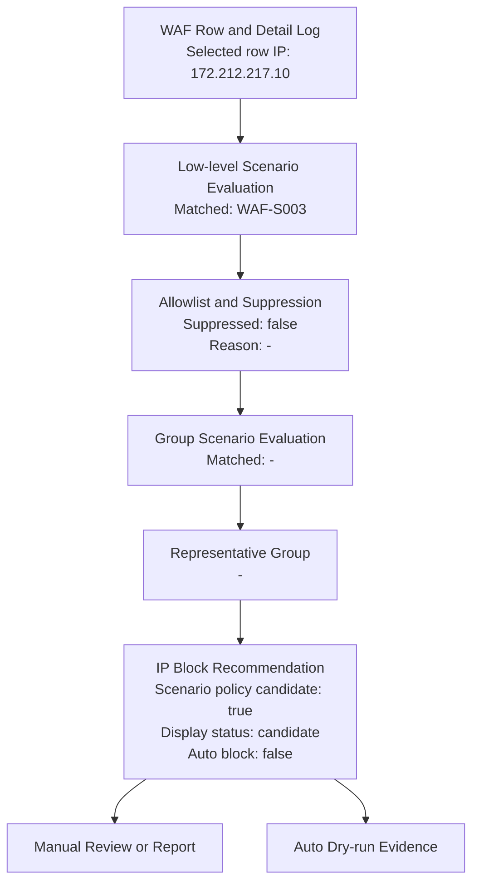
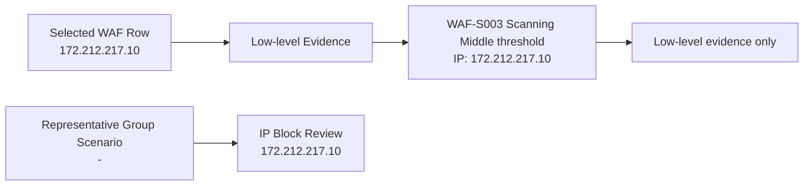
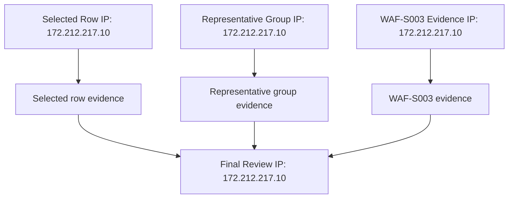

# WAF IP 차단 검토 필요

공격자 IP 172.212.217.10에서 오늘 총 20개 정탐이 탐지되었습니다. PHP/WordPress 계열 경로 스캔이 반복되었고, /mimes.php 요청은 WAF에서 차단되었습니다. PLURA-WAF 세션 차단뿐 아니라 IP주소 차단 검토가 필요합니다.

- 대표 운영형 시나리오: -
- 운영형 판단 사유: -
- 상세 근거: WAF-S003

## 분석 결과 요약

- 실행 상태: OK
- 조회 날짜: 오늘 / 2026-05-02 ~ 2026-05-02
- 공격자 IP: 172.212.217.10
- IP 차단 후보: 예, 수동 검토 후보
- 시나리오 기반 차단 후보: 예, 수동 검토 후보
- 관측 fallback 기반 추가 검토: 불필요
- 일반 반복 IP fallback 검토: 별도 승격 없음
- 최종 수동 확인: 필요
- fallback 차단 후보 승격 보류 사유: scenario 선택 실행에서는 일반 반복 IP fallback을 차단 후보로 승격하지 않음
- evidence scope mismatch: false
- 확인 대상 IP: 172.212.217.10
- IP 근거 불일치: false

## 선택 row 기준 요약

- selectedRowIp: 172.212.217.10
- 총 이벤트 수: 20
- 차단 수: 0
- 탐지 수: 20
- 고유 경로 수: 20

## 대표 시나리오 근거 요약

- representativeScenario: WAF-S003 Scanning Middle threshold
- representativeScenarioIp: 172.212.217.10
- representativeGroupIp: 172.212.217.10
- scenarioEvidenceIps: 172.212.217.10
- evidenceTotalEvents: -
- evidenceDistinctAttackTypes: -
- evidenceUniquePaths: 20
- evidenceSamplePaths: /mimes.php, /you.php, /pdf.php, /phpprobe.php, /album.php, /phpstatus.php, /yindu.php, /conf.php
- 사용자 수동 확인 대기: true
- 브라우저 유지: false
- 자동 IP 차단 수행: false
- 확인 대상 IP: 172.212.217.10
- IP 차단 후보: 예, 수동 검토 후보
- 발송 판단: 반복성 낮음 또는 발송 조건 미충족
- 종료 방법: 설정된 대기 시간 후 자동 종료

## IP 차단 검토 안내

- 판단 이유: 대표 시나리오 WAF-S003 Scanning Middle threshold 매칭: 동일 IP 172.212.217.10에서 스캐닝성 MIDDLE 이벤트가 20건 확인되어 기준 20건 이상입니다.
- 권고 조치: 웹 화면에서 해당 IP의 요청 경로와 탐지/차단 이력을 확인한 뒤 IP주소 차단을 검토하세요.
- 자동 차단 수행: false
- 수동차단 안내 활성화: true
- 브라우저 안내 overlay 표시: true
- 수동차단 버튼 위치 확인: false
- 수동차단 버튼 selector: -
- 수동차단 버튼 클릭: false
- 저장/확인 클릭: false
- 수동 IP 차단 매뉴얼: https://docs.plura.io/ko/v6/fn/comm/ipblock/manual

## Allowlist / Suppression

- suppressed: false
- action: -
- matchedRuleId: -
- matchedValue: -
- matchedField: -
- matchedIp: -
- reason: -
- result: allowlist suppression 미적용

## 매칭된 시나리오

- 선택: 1-11 => [1, 2, 3, 4, 5, 6, 7, 8, 9, 10, 11]
- matchedScenarios: [3]
- matchedCount: 1
- representativeScenario: WAF-S003 Scanning Middle threshold
- representativePriorityScore: 40
- representativeReason: 동일 IP 172.212.217.10에서 스캐닝성 MIDDLE 이벤트가 20건 확인되어 기준 20건 이상입니다.
- evaluatedScenarios: 11
- 시나리오 정책상 후보: 예
- displayCandidateStatus: 예, 수동 검토 후보
- autoBlock: false

## 탐지 판단 흐름도

## IP 근거 분리도

## 운영형 대표 시나리오

- matchedGroupScenarios: []
- representativeGroupScenario: -
- representativeGroupPriorityScore: -
- representativeGroupReason: -
- representativeLowLevelScenario: -

| group | priorityScore | matched | mapped | matchedLowLevel | reason |
|---|---:|---:|---|---|---|
| WAF-G001 반복 스캐닝 기반 IP 차단 검토 | 50 | false | 2, 3, 4, 5 | - | Low/Middle 반복 스캐닝은 기본 report-only 정책이므로 운영형 WAF-G001 승격 조건에는 도달하지 않았습니다. |
| WAF-G002 고위험 단건 공격 검토 | 70 | false | 6 | - | Mapped low-level scenarios did not match. |
| WAF-G003 고객사 중요 필터 검토 | 65 | false | 7 | - | Mapped low-level scenarios did not match. |
| WAF-G004 공격 시퀀스 기반 검토 | 85 | false | 9 | - | Mapped low-level scenarios did not match. |
| WAF-G005 복합 공격 유형 검토 | 80 | false | 10 | - | Mapped low-level scenarios did not match. |
| WAF-G006 분산 유사 공격 검토 | 90 | false | 11 | - | Mapped low-level scenarios did not match. |
| WAF-G007 외부 평판/TI 보강 검토 | 75 | false | 1 | - | Mapped low-level scenarios did not match. |
| WAF-G008 AI 분석 보강 검토 | 60 | false | 8 | - | Mapped low-level scenarios did not match. |

| scenario | priorityScore | matched | attackerIp | reason |
|---|---:|---:|---|---|
| WAF-S001 VT malicious ratio | 90 | false | 172.212.217.10 | VT 분석 결과가 없어 수동차단 후보로 올리지 않습니다. |
| WAF-S002 Scanning Low threshold | 30 | false | - | 스캐닝성 LOW 이벤트가 기준 30건에 도달하지 않았습니다. |
| WAF-S003 Scanning Middle threshold | 40 | true | 172.212.217.10 | 동일 IP 172.212.217.10에서 스캐닝성 MIDDLE 이벤트가 20건 확인되어 기준 20건 이상입니다. |
| WAF-S004 Scanning High threshold | 50 | false | - | 스캐닝성 HIGH 이벤트가 기준 10건에 도달하지 않았습니다. |
| WAF-S005 Scanning Critical threshold | 65 | false | - | 스캐닝성 CRITICAL 이벤트가 기준 3건에 도달하지 않았습니다. |
| WAF-S006 Non-scanning Critical | 70 | false | - | 비스캐닝 CRITICAL 이벤트가 확인되지 않았습니다. |
| WAF-S007 Customer custom filter | 55 | false | - | 매칭되는 고객사 커스텀 필터 탐지가 없어 수동차단 후보로 올리지 않습니다. |
| WAF-S008 AI malicious probability | 75 | false | 172.212.217.10 | AI 분석 결과가 없어 수동차단 후보로 올리지 않습니다. |
| WAF-S009 Threat sequence judgment | 80 | false | 172.212.217.10 | 로그 순서 기반 위협 시퀀스가 확인되지 않았습니다. |
| WAF-S010 Mixed attack types by same IP | 60 | false | 172.212.217.10 | 동일 IP의 복수 공격 유형 혼합 기준에 도달하지 않았습니다. |
| WAF-S011 Distributed similar attack burst | 85 | false | - | 분산 유사 공격 기준에 도달하지 않았습니다. |

## 시나리오 상세 근거

### WAF-S003 Scanning Middle threshold
- priorityScore: 40
- attackerIp: 172.212.217.10
- attackerIps: -
- reason: 동일 IP 172.212.217.10에서 스캐닝성 MIDDLE 이벤트가 20건 확인되어 기준 20건 이상입니다.
- recommendation: 웹 화면에서 해당 IP의 요청 경로와 탐지/차단 이력을 확인한 뒤 IP주소 수동차단을 검토하세요.
- evidence: {"severity":"MIDDLE","threshold":20,"count":20,"uniquePaths":20,"samplePaths":["/mimes.php","/you.php","/pdf.php","/phpprobe.php","/album.php","/phpstatus.php","/yindu.php","/conf.php"]}

## 최종 IP 차단 검토 사유

최종 IP 차단 검토 사유: WAF-S003 동일 IP 172.212.217.10에서 스캐닝성 MIDDLE 이벤트가 20건 확인되어 기준 20건 이상입니다. 자동 IP 차단은 수행하지 않으며 담당자가 웹 화면에서 수동 확인 후 결정합니다.

## 반복 요청 경로

| path |
|---|
| /mimes.php |
| /you.php |
| /pdf.php |
| /phpprobe.php |
| /album.php |
| /phpstatus.php |
| /yindu.php |
| /conf.php |
| /search.php |
| /00.php |
| /aw.php |
| /u.php |
| /teste.php |
| /creds.php |
| /xinfo.php |
| /lmfi2.php |
| /7.php |
| /styles.php |
| /oauth.php |
| /profiler.php |

## 우선순위 차단 이벤트

- 공격자 IP: 172.212.217.10
- 대상 도메인: blog.plura.io
- 요청 Method: GET
- URI/path: /mimes.php
- 쿼리/요청본문: -
- HTTP 상태값: 404
- 탐지/차단 유형: 탐지(OWASP)
- WAF 필터명: UA 누락 + PHP 파일 요청
- 위험도/risk: -
- 탐지 시각: 2026-05-02 10:15:25.915
- 분석 탭 수집: true
- 로그 탭 수집: true

## 원본 로그 주요 필드

- method: GET
- uri: /mimes.php
- host: blog.plura.io
- remoteIp: 172.212.217.10
- responseStatus: 404

## 담당자 확인 항목

1. 공격자 IP 172.212.217.10의 동일 시간대 반복 요청 전체 확인
2. 반복 경로가 PHP/WordPress 백도어/관리자 경로 스캔인지 확인
3. 탐지(OWASP)와 HTTP 404이 정상 차단 정책과 일치하는지 확인
4. 동일 IP의 후속 요청이 계속 발생하는지 확인
5. 웹 UI에서 IP주소 차단 등록 여부 결정